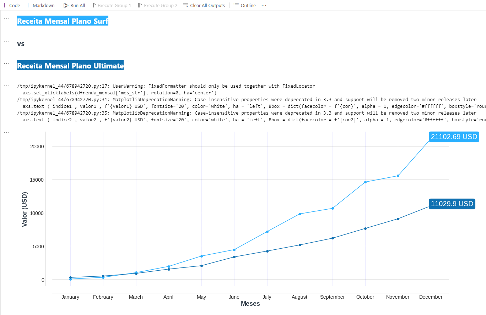
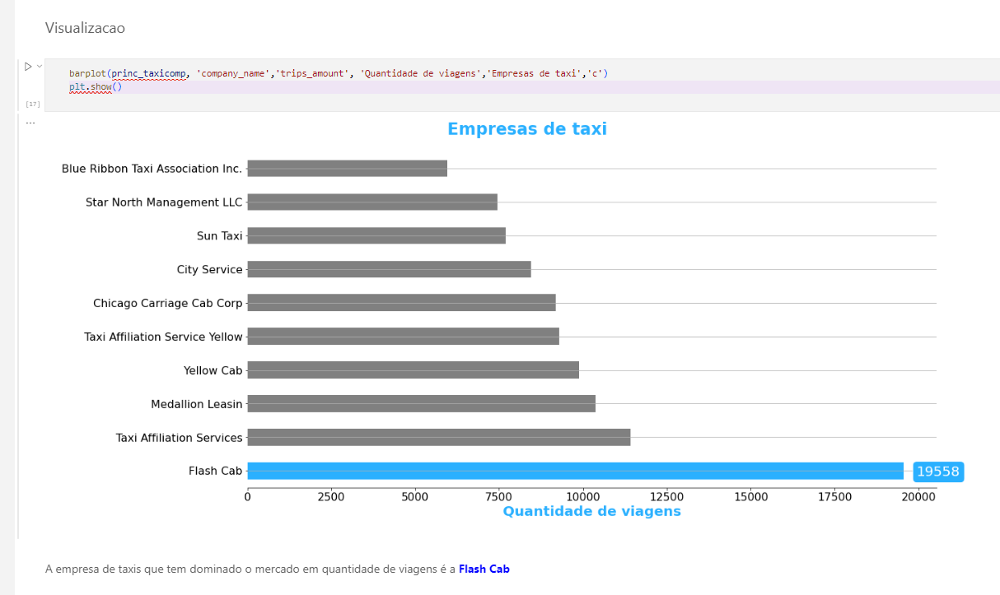
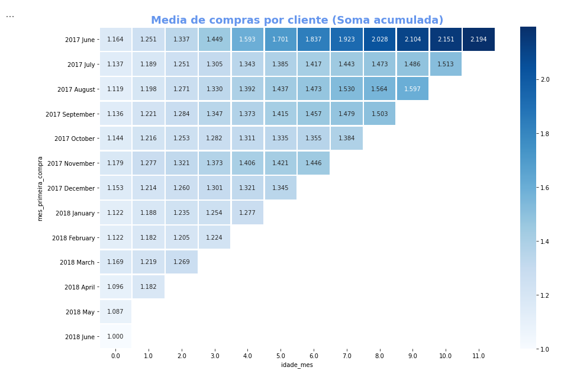
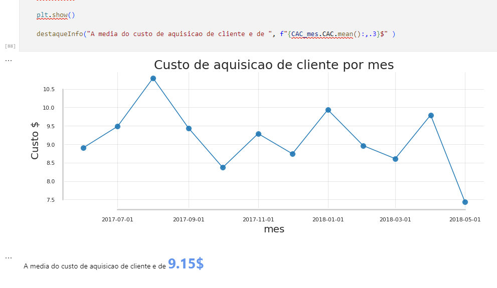
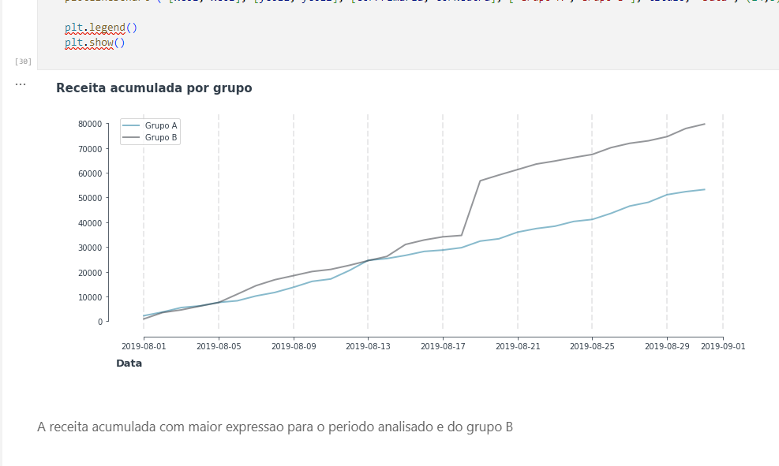
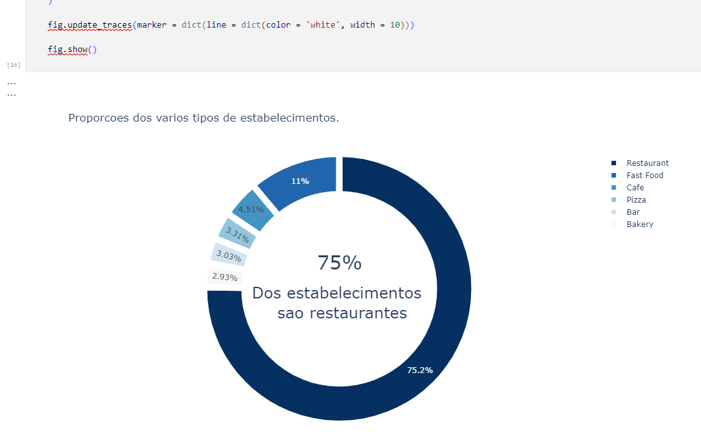
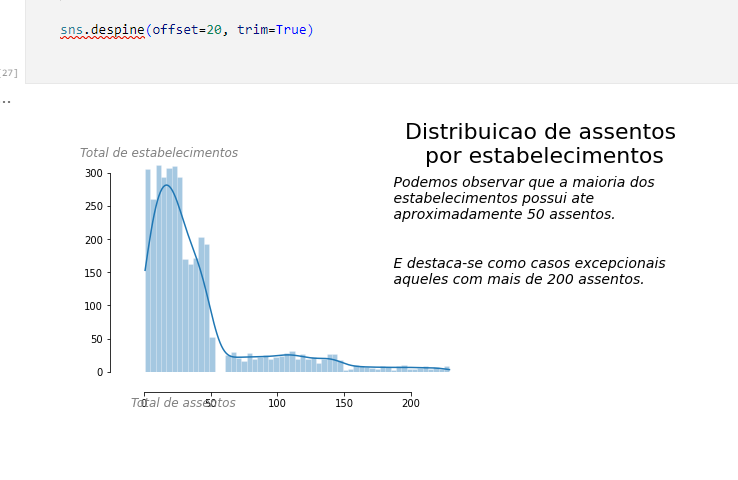

# Projectos Practicum/TripleTen

Projectos criados durante o curso de analise de dados no bootcamp Practicum/TripleTen

## 🛠 Ferramentas Utilizadas

[](https://www.python.org/downloads/release/python-396/)  [](https://pypi.org/project/pandas/1.5.2/)  [](https://pypi.org/project/numpy/1.24.2/)  [](https://pypi.org/project/jupyter/1.1.1/)  [](https://pypi.org/project/plotly/5.15.0/)  [](https://pypi.org/project/seaborn/0.12.2/)

## 👨‍💻 Autor

- [@ Gerson Barroso](https://github.com/barrosogerson/ProjectosPracticum)

### 🚀 Sobre mim

. . . 

### 🔗 Links

[](https://www.linkedin.com/in/gerson-barroso-424918128/)
[](https://www.datacamp.com/portfolio/gersonbarroso)
[](https://platform.stratascratch.com/user/gb)

## 🎓 Aprendizados

Durante o desenvolvimento destes projetos de análise de dados em Python, diversos aprendizados foram adquiridos, tanto em termos técnicos quanto metodológicos. 
Alguns dos principais incluem:

- Manipulação Eficiente de Dados: Aprimoramento no uso do Pandas para filtrar, transformar e agregar dados de forma otimizada, reduzindo o tempo de processamento.
- Visualização e Comunicação de Insights: Melhor entendimento sobre como escolher os gráficos adequados e como tornar as visualizações mais impactantes usando Matplotlib e Seaborn.
- Tratamento de Dados Reais: Experiência na limpeza e preparação de dados do mundo real, lidando com valores ausentes, dados inconsistentes e outliers.
- Análise Estatística e Exploratória: Aplicação de conceitos estatísticos para compreender distribuições, correlações e tendências nos dados.
- Automação e Reprodutibilidade: Criação de scripts reutilizáveis para tornar o processo de análise mais eficiente e replicável em diferentes cenários.
- Melhores Práticas em Programação: Organização do código, uso de funções modulares e documentação clara para facilitar a manutenção e escalabilidade dos projetos.
- Esses aprendizados contribuíram para um entendimento mais profundo sobre análise de dados e boas práticas de desenvolvimento, tornando cada projeto mais eficiente e estruturado.

## ✍️ Melhorias

Ao longo do desenvolvimento dos projetos, foram aplicadas diversas melhorias para otimizar a análise e visualização dos dados. 
Algumas das principais melhorias incluem:

- Eficiência no Processamento de Dados: Uso otimizado do Pandas para manipulação eficiente de grandes conjuntos de dados, incluindo melhorias no desempenho ao carregar e processar arquivos CSV e Excel.  
- Visualizações Aprimoradas: Implementação de gráficos mais informativos e personalizados com Matplotlib e Seaborn, utilizando cores, anotações e layouts mais claros para facilitar a interpretação dos insights.  
- Automatização de Processos: Scripts refinados para automação de tarefas repetitivas, como limpeza de dados e geração de relatórios, reduzindo o tempo de análise.  
- Integração de Novas Bibliotecas: Uso de bibliotecas adicionais para enriquecer as análises, como SciPy para estatísticas avançadas e Plotly para visualizações interativas.  
- Melhoria na Qualidade dos Dados: Implementação de técnicas avançadas de tratamento de dados ausentes e outliers para garantir análises mais precisas.  
- Essas melhorias aumentaram a eficiência e a precisão das análises, tornando os projetos mais robustos e fáceis de interpretar.  

## Screenshots










## Executar os projectos
 
### 1️⃣ Instalar o python 3.9.6 e Bibliotecas Necessárias
- Antes de iniciar, certifique-se de que possui o Python instalado. Caso ainda não tenha, baixe e instale a versão mais recente em [python.org](https://www.python.org/downloads/release/python-396/).

- Em seguida, instale o Jupyter Notebook e as bibliotecas utilizadas nos projetos executando os seguintes comandos no terminal ou prompt de comando:

```bash
pip install jupyter==1.1.1
pip install numpy==1.24.2
pip install pandas==1.5.2
pip install seaborn==0.12.2
pip install plotly==5.15.0
```

2️⃣ Executar o Jupyter Notebook

```jupyter notebook```


3️⃣ Abrir e Executar os Notebooks

- Navegue até a pasta onde os notebooks do projeto estão salvos.
- Clique no arquivo desejado (.ipynb) para abri-lo.
- Para executar as células de código, pressione Shift + Enter ou clique no botão ▶️ "Run".

4️⃣ Fechar o Jupyter Notebook

- Após finalizar a análise, para encerrar o Jupyter Notebook, pressione `Ctrl + C` no terminal e confirme a interrupção pressionando `Y`.
