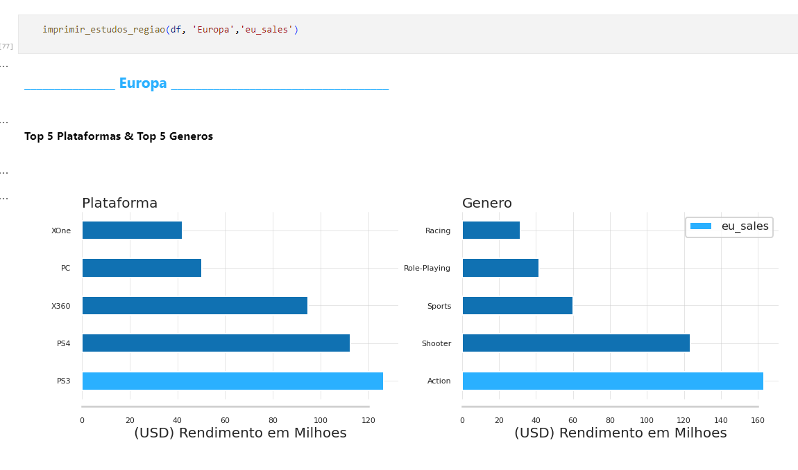

# Projectos Practicum/TripleTen

Projectos criados durante o curso de analise de dados no bootcamp Practicum/TripleTen

## 🛠 Ferramentas Utilizadas

[](https://www.python.org/downloads/release/python-396/)  [](https://pypi.org/project/pandas/1.5.2/)  [](https://pypi.org/project/numpy/1.24.2/)  [](https://pypi.org/project/jupyter/1.1.1/)  [](https://pypi.org/project/plotly/5.15.0/)  [](https://pypi.org/project/seaborn/0.12.2/)

## 👨‍💻 Autor

- [@ Gerson Barroso](https://github.com/barrosogerson/ProjectosPracticum)

### 🚀 Sobre mim

. . . 

### 🔗 Links

[](https://www.linkedin.com/in/gerson-barroso-424918128/)
[](https://www.datacamp.com/portfolio/gersonbarroso)
[](https://platform.stratascratch.com/user/gb)

## 🎓 Aprendizados

. . .

## ✍️ Melhorias

. . . 

## Screenshots





## Executar os projectos

### Instalar o python 3.9.6
### Instalar as libs do python

```bash
pip install jupyter==1.1.1
pip install numpy==1.24.2
pip install pandas==1.5.2
pip install seaborn==0.12.2
pip install plotly==5.15.0
```

